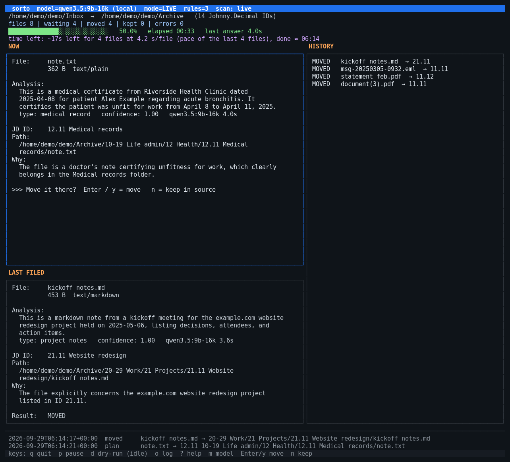

# sorto

**sorto files your loose files into your [Johnny.Decimal](https://johnnydecimal.com/) archive using an AI model that runs on your own computer.** It reads each file, tells you in plain English what the file is, picks the right folder, and moves it there. Nothing is sent to the internet.



## In short

- **Point it at an inbox and your archive.** For each file sorto shows what it is, which Johnny.Decimal ID it belongs in and why, and the full destination path. Then it moves the file and goes on to the next one.
- **It looks inside files:** the text of PDFs and documents, email senders and subjects, photo dates and GPS positions (sorto tells the model which city a position is in), the pictures and video frames themselves, and the title, part names and preview picture stored in a 3D model file.
- **It follows your structure** (areas, categories, IDs, JDex notes, subfolders). It never overwrites anything, and files it is unsure about stay where they are.
- **100% local:** it only talks to a model server on this machine ([Ollama](https://ollama.com/)).

## Quick start

You need Python 3.11+, Ollama and pipx.

```bash
ollama pull qwen3.6:35b-a3b                                # the default model, about 23 GB
pipx install git+https://github.com/janttsu/sorto.git

sorto doctor ~/Downloads -t ~/Archive                       # checks the folders, the model, the tools
sorto run ~/Downloads -t ~/Archive --dry-run --once        # show what would happen, move nothing
sorto run ~/Downloads -t ~/Archive --confirm               # file for real, asking before every move
```

`~/Archive` is your Johnny.Decimal root, with folders like `10-19 Life/11 Money/11.11 Bills`. **No structure yet?** sorto surveys your files, proposes one that fits them (numbered correctly, with descriptions), shows it and creates it only when you agree. You can also edit the proposal first; see `sorto init`. `sorto index ~/Archive` shows the structure sorto found. Optional tools improve the analysis: `pdftotext`, `exiftool`, `ffmpeg`, ImageMagick and `file`.

## Everyday use

```bash
sorto run SOURCE -t TARGET            # sort SOURCE into TARGET, keep watching for new files
sorto run SOURCE -t TARGET --once     # sort what is there now, then exit
sorto run DIR -t DIR --dry-run        # same folder twice: tidy an existing archive in place
sorto run "DIR/10-19 Life/14 Travel" -t DIR   # tidy one area or category of it in place
sorto resume SOURCE -t TARGET         # continue, and retry files that failed
sorto run SOURCE -t TARGET --retry-kept   # also ask again about files an earlier run left for you
sorto run SOURCE -t TARGET --clear-cache  # first forget cached model answers and folder decisions
sorto status SOURCE -t TARGET         # counts, and where the index is
sorto fsck TARGET                     # the model reviews the tree; accept fixes to the JDex notes file by file
sorto rules                           # show / create your own rules
sorto init DIR --dry-run              # propose a Johnny.Decimal structure for DIR
```

Without `--model NAME` the TUI first asks which local model reads the files, listing every model your Ollama has. TUI keys: `q` quit, `p` pause, `↑`/`↓` browse the files already handled, `?` help, and with `--confirm` `Enter` to move or `n` to keep.

## Your own rules

Write rules in plain language, in any language, in `~/.config/sorto/rules.md`:

```markdown
- Emails from billing@example.com go to 13.13.
- Screenshots always go to 51.12.
- Photos taken between 2025-06-01 and 2025-06-14 belong to 14.12 (summer trip).
- Everything about Example Club goes under an ID of its own.
```

The model follows them for every file and shows which rule it used. A rule can ask for an ID of its own: if it does not exist yet, sorto creates it for the first such file. A rule can also ask for files to be kept in folders named after what they are ("knitting patterns go to 32.11, each in a folder named after the garment"); sorto creates those folders inside the ID. The file is re-read every minute, so edits apply while sorto runs.

A second file, `~/.config/sorto/junk.md`, lists file patterns that are never needed. Those files go straight into one folder of your archive, without asking the model (they are moved, never deleted):

```
into: 99.11
*.dll
*.pdb
Thumbs.db
*.log -> 00.13
```

## Good to know

- **Git repositories are never touched.** Nothing is moved out of, around in, or into a repository (bare ones included). This is built in; no rule or setting changes it. Unpacked software (an extracted AppImage, a copied Unix root) is kept whole the same way, and JDex notes (a file named JDex, anything in an `NN.00` folder) are never moved, also when the source is a Johnny.Decimal tree of its own.
- **Nothing is overwritten.** Name clashes become `name-2.ext`. Nothing is deleted unless you ask for it (`--delete-duplicates`, `--delete-junk`).
- **Folders that belong together move together.** An album, a trip, a project or a monthly dump is judged once as a whole and moved into an ID as one folder, keeping its name and structure. Every file is still checked on its own (type, EXIF date, GPS, camera), and a file that stands out is sorted separately. Mixed folders are sorted file by file. `--no-folders` turns this off.
- **Your own photos and videos are filed by date.** Whatever ID they belong in, they go into `YYYY/MM` inside it, by the capture date in the file. Downloads, memes and screenshots are not, and neither is a photo with no capture date.
- **Uncertain files stay put.** Low confidence or an unclear answer leaves the file in the source, with the reason shown and logged.
- **New IDs are numbered by sorto.** If nothing fits, the model may propose a new ID in an existing category. sorto double-checks the category, takes the next free number, creates the folder and only then moves the file. An answer that is not an existing ID (a made-up number, an area, a path) is handled the same way: sorto asks the model for a name and creates the ID. If no category fits, sorto creates a new category in an existing area, again with the next free number; if that does not work out either, the file stays and the log says why. These decisions are always made by the big model (`structure_model`), also when the small one reads the files. `--no-new-ids` and `--no-new-categories` turn this off.
- **Every run writes its own log.** `~/.sorto/<pair>/runs/run-<date>_<time>.log` lists each file, what the analysis said about it and where it went. The path is printed when the run starts. At the end the run also says what it left in the source and why (duplicates, files left for you, git repositories, software packages).
- **It remembers its progress** in `~/.sorto/`, so a second run continues where the first stopped. Delete the pair's `index.sqlite` there to start over.
- **Moves are crash-safe,** and on btrfs they use instant reflink clones between subvolumes.
- **Any local model:** the default `qwen3.6:35b-a3b`, or for example a small `qwen3.5:9b` setup that is about 3× faster on a 6 GB GPU. Pick it with `--model`, or from the list the TUI shows at the start. New IDs and categories are decided by `structure_model` (the big one) either way.

More: [settings, models, reorganizing, photos, rules and safety details](docs/DETAILS.md).

The list of cities used to name GPS positions is from [GeoNames](https://www.geonames.org/) (CC BY 4.0).

Changes are listed in [CHANGELOG.md](CHANGELOG.md). sorto is in beta: try `--dry-run` or `--confirm` first.

## Development

```bash
make install    # venv + editable install
make test
make lint
```
